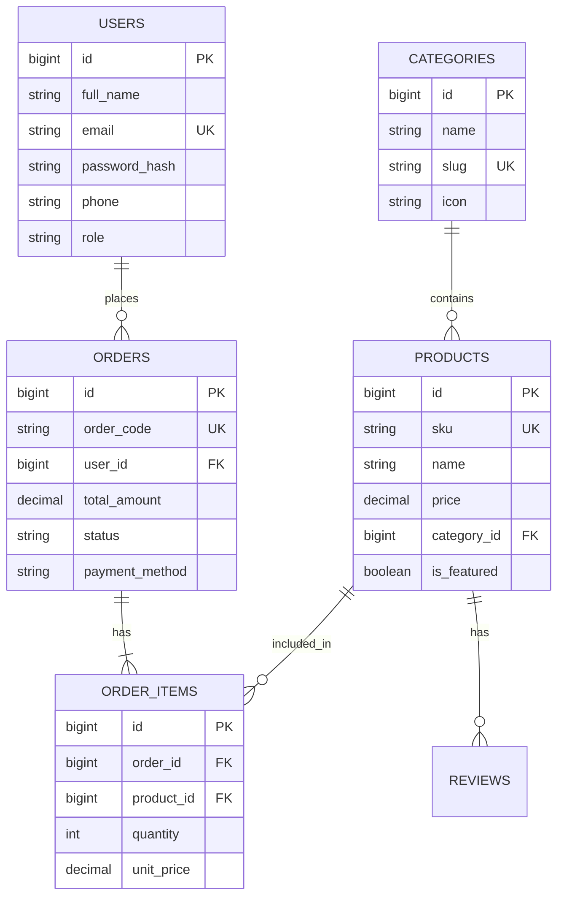

# StoreKit Database ERD & Schema Documentation

## Sơ đồ Thực thể Mối quan hệ (ERD)

```mermaid
erDiagram
    USERS ||--o{ ORDERS : "places"
    CATEGORIES ||--o{ PRODUCTS : "contains"
    PRODUCTS ||--o{ ORDER_ITEMS : "included_in"
    ORDERS ||--|{ ORDER_ITEMS : "has"
    PRODUCTS ||--o{ REVIEWS : "has"

    USERS {
        bigint id PK
        string full_name
        string email UK
        string password_hash
        string phone
        string role
    }

    CATEGORIES {
        bigint id PK
        string name
        string slug UK
        string icon
    }

    PRODUCTS {
        bigint id PK
        string sku UK
        string name
        decimal price
        bigint category_id FK
        boolean is_featured
    }

    ORDERS {
        bigint id PK
        string order_code UK
        bigint user_id FK
        decimal total_amount
        string status
        string payment_method
    }

    ORDER_ITEMS {
        bigint id PK
        bigint order_id FK
        bigint product_id FK
        int quantity
        decimal unit_price
    }
```
