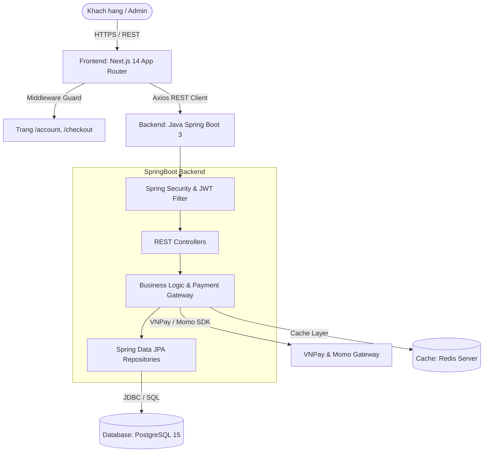

# StoreKit Enterprise Architecture Overview

## So do Tong quan Kien truc He thong

```mermaid
graph TD
    User([Khach hang / Admin]) -->|HTTPS / REST| NextJS[Frontend: Next.js 14 App Router]
    NextJS -->|Middleware Guard| ProtectedRoutes[Trang /account, /checkout]
    NextJS -->|Axios REST Client| SpringBoot[Backend: Java Spring Boot 3]
    
    subgraph SpringBoot Backend
        Security[Spring Security & JWT Filter]
        Controllers[REST Controllers]
        Services[Business Logic & Payment Gateway]
        Repositories[Spring Data JPA Repositories]
    end

    SpringBoot --> Security
    Security --> Controllers
    Controllers --> Services
    Services --> Repositories
    
    Services -->|VNPay / Momo SDK| PaymentAPI[VNPay & Momo Gateway]
    Repositories -->|JDBC / SQL| Postgres[(Database: PostgreSQL 15)]
    Services -->|Cache Layer| Redis[(Cache: Redis Server)]
```
